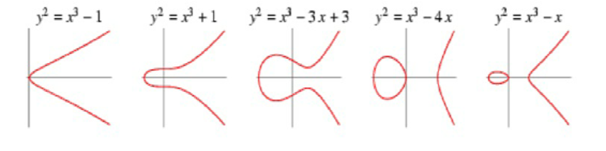
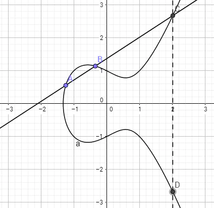
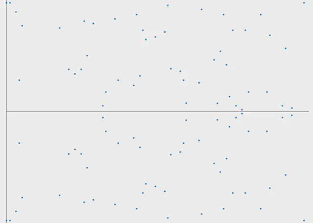

# ECDSA MPC - GG18/GG20 协议

## ECDSA

### 基本概念

ECDSA - Elliptic Curve Digital Security Algorithm **椭圆曲线**数字签名算法，是一种公钥密码算法。

公钥密码算法使得一个用户可以生成一对公钥/私钥对，然后公开公钥，保留私钥，在与另一方通信时：
* 让另一方使用公钥加密信息，自己使用私钥解密。
* 自己使用私钥签名，让另一方使用公钥验证签名。

使用 ECDSA 签名一个消息，会生成两个部分，`R`和`S`，两个整数。

消息接收方拥有的是：
* 消息内容
* 发送方公钥
* 整数`R`
* 整数`S`

消息接收方收到消息后，将公钥和`S`代入某个给定的公式，可以算出一个数`R1`，如果`R1`与`R`相等，则验证签名成功。

ECDSA 使用的都是整数，没有浮点数，即`R`和`S`也都是整数。

### 椭圆曲线

椭圆曲线是指以下形式的方程：

$$y^2 = x^3 + ax + b$$

几种不同图像形状的椭圆曲线：

为了说明 ECDSA 的原理，我们还需要定义以下计算。

#### 椭圆曲线的点加法

为了简略和直观，我们跳过代数计算形式。假设椭圆曲线

$$y^2 = x^3 + ax + b$$

上有两点`A`和`B`，连接两点与曲线可交于另一点`C`，并可以得到其与X轴对称的、同样也在曲线上的点`D`。（根据椭圆曲线的表达式易得`D`必定在曲线上）

则我们定义，点`D`就是`A`和`B`两个点的和：

$$A + B = D$$

如图所示：

#### 椭圆曲线的标量乘法

椭圆曲线的标量乘法就是点加法的多次运算：

$2 * A = A + A$

$3 * A = A + A + A$

$k * A = A + A + A + ... + A = (k - 1) * A + A$

#### 椭圆曲线的群

可以为椭圆曲线定义这样一个群：

* 群里的元素都是椭圆曲线上的点
* 单位元（幺元）是无限远处的某个点
* 椭圆上点 $P$ 的逆元 $-P$ 是与X轴对称且在曲线上的点。
* 加法如上文定义所示。

使用群论语言描述 ECDSA 算法将便利许多。

#### 椭圆曲线计算的特点 - 单向陷阱门 (Trapdoor)

由于没有所谓的椭圆曲线点减法或者除法，除了枚举，椭圆曲线点乘法的结果无法倒推。也就是说，给定以下计算

$$kA = B$$

当点 $A$ 和点 $B$ 已知时，并不存在 $k = \dfrac{A}{B}$ 这样的公式可以直接计算出 $k$。

**该特点是 ECDSA 算法族的核心。** 

该问题被称作离散对数问题（Discrete logarithm problem），因为往往也被记作：

$$A^k \equiv B\mod{p}$$

被认为是在目前技术下有指数时间复杂度甚至更高的问题，当所选取的质数很大时，当代计算机无法在有效时间内暴力破解。

#### 对椭圆曲线的调整

因为如上文所说，密码学中使用的数都需要是整数，因此密码学上，需要对椭圆曲线用质数取模，即：

$$ y^2 \equiv (x^3 + ax + b)\mod{p}$$

其中 $p$ 为质数。

调整之后的曲线图像会像下面这样：

### ECDSA 算法的原理

#### 参数

ECDSA 算法首先需要给定一条椭圆曲线，一条椭圆曲线的定义需要如下参数组

$$D = (p, a, b, G, N)$$

其中：
* $p$ 是模运算的底，即这个有限域的大小，必须是质数。
* $a$ 和 $b$ 是曲线系数
* $G$ 是起始点，生成该曲线上的循环子群。
* $N$ 是曲线上点的个数，也就是椭圆曲线群的阶。

该参数组有时候也被写作六元组：

$$D = (p, a, b, G, n, h)$$

其中：
* $n$ 是由 $G$ 产生的子群的阶
* $h$ 则是 $h = \dfrac{N}{n}$ 计算出的子群协因子， $N$ 是椭圆曲线群的阶。

选定参数后，需要随机生成一个私钥 $d_A$，有了起始点 $G$，公钥就可以如下计算：

$$Q_A = d_A * G$$

#### 流程

用户A需要发送一条消息`m`给用户B并签名：

准备阶段（发送方用户A）：
1. 选定一条曲线 $D = (p, a, b, G, N)$
2. 随机产生一个密钥 $d_A$
    * 选择于范围 $[1, n - 1]$
3. 使用 $d_A$ 和 $G$ 用椭圆曲线标量乘法计算公钥 $Q_a = d_A * G$

签名阶段（发送方用户A）：
1. 用一种哈希算法，例如SHA1，SHA2等，计算消息`m`的哈希值 $e = HASH(m)$
2. 取 $e$ 的左 $n$ 位数，得到数 $z$。
3. 随机产生一个随机数 $k$。
    * 该随机数 $k$ 一般为20字节，160比特。
    * 选择于范围 $[1, n - 1]$
4. 使用 $k$ 和 $G$ 用椭圆曲线标量乘法计算 $P = k * G$
5. 点 $P = (x_1, y_1)$ 的 $x$ 坐标 $x1$ 就是 $r$。
    * 准确地说， $r = x_1\mod{n}$
    * 如果算出来的 $r = 0$，返回第3步。
6. 计算 $s = k^{-1}(z + rd_A)\mod{n}$
    * $k^{-1}$ 是 $k$ 的模的乘法逆元
    * 如果算出来的 $s = 0$，返回第3步。

签名总结：

$$r = k * G$$

或者记为

$$r = g^k$$

$$s = k_{-1}(m + x * r) \mod{q}$$

验证阶段（接收方用户B）：

用户B应该首先验证公钥 $Q_A$ 的有效性：
1. 检验 $Q_A$ 在曲线上
2. 检验 $n * Q_A = O$

然后检验如下：
1. 验证 $r$ 和 $s$ 都在 $[1, n - 1]$ 中
2. 计算 $z$，同签名阶段
3. 计算 $u_1 = z * s^{-1}\mod{n}$ 和 $u_2 = r * s^{-1}\mod{n}$
4. 计算一个点 $P (x_1, y_1) = u_1 * G + u_2 * Q_A$
5. 如果 $r \equiv x_1\mod{n}$ 则验证通过

### 攻击

不仅私钥需要保持秘密，每次签名选定的随机数 $k$ 也必须保持秘密，且每次都需要用一个新的随机数。

索尼的 PS3 使用的就是 ECDSA 算法，曾经因为 $k$ 不变而被破解。攻击者只需要生成两个不同文件的签名，就可以计算出 $k$。

假设这两个文件的哈希值是 $z$, $z'$，签名中的 $s$ 是 $S$ 和 $S'$ 公式如下：

$$
\begin{aligned}
S - S' &= k^{-1}(z + d_AR) - k^{-1}(z' + d_AR)\\
&= k^{-1}(z + d_AR - z' - d_AR)\\
&= k^{-1}(z - z')
\end{aligned}
$$

所以 $k = \dfrac{(z - z')}{(S - S')}$。从而计算出私钥： $d_A = \dfrac{kS - z}{R}$

### 应用 - 以太坊 - secp256k1

以太坊使用 ECDSA 签名。以太坊使用的是一个叫做 secp256k1 的曲线，它由密码技术公司 Certicom 选择并推荐。

Secp256k1 的曲线参数如下（均为十六进制表示）：

$$p = FFFFFFFF FFFFFFFF FFFFFFFF FFFFFFFF FFFFFFFF FFFFFFFF FFFFFFFE FFFFFC2F$$

可以用十进制表示为：

$$p= 2^{256} - 2^{32} - 2^9 - 2^8 - 2^7 - 2^6 - 2^4 - 1$$

这个数字是小于 $2^{256}$ 的最大质数。

* $a = 00000000 00000000 00000000 00000000 00000000 00000000 00000000 00000000$
* $b = 00000000 00000000 00000000 00000000 00000000 00000000 00000000 00000007$

即曲线形式为：

$$y^2 = x^3 + 7$$

点 $G$ 的表达使用的是十六进制压缩形式，语法为：
* `04 + X坐标 + Y坐标` 是非压缩形式
* 若是压缩形式，则：
    * `02 + X坐标` 表示Y坐标是偶数
    * `03 + X坐标` 表示Y坐标是奇数

$G$ 的压缩形式是

$$G = 02 79BE667E F9DCBBAC 55A06295 CE870B07 029BFCDB 2DCE28D9 59F2815B 16F81798$$

非压缩形式是

$$G = 04 79BE667E F9DCBBAC 55A06295 CE870B07 029BFCDB 2DCE28D9 59F2815B 16F81798 483ADA77 26A3C465 5DA4FBFC 0E1108A8 FD17B448 A6855419 9C47D08F FB10D4B8$$

从 $G$ 得到的子群阶 $n$ 是：

$$n = FFFFFFFF FFFFFFFF FFFFFFFF FFFFFFFE BAAEDCE6 AF48A03B BFD25E8C D0364141$$

协因子 $h$ 是：

$$h = 01$$

## MPC and TSS

### 基本概念

#### MPC

MPC 是 Multiparty Computation 的缩写，即多方参与的计算。在密码学中，指的是多方参与的加密、密钥生命周期管理等过程。

MPC 之所以受到关注，是因为它本质上可以令私钥的管理更为安全，私钥从生成、存储、使用、备份乃至销毁，都不会完整地出现在网络的任何部分。 因为没有一方拥有完整的密钥，也就不会有单点问题。

MPC 广义上说是指多方参与的计算，但实际上它侧重点是在于满足如下条件：
* 参与各方不暴露自己的隐私
* 参与各方互不信任
* 没有一个中心化的信任节点参与协调

因此 MPC 的实现方案往往需要采用大量巧妙的零知识证明设计。

#### TSS

TSS 是 Threshold Signature Scheme 的缩写，即门限签名算法。

TSS 是一种 MPC 方案。一个签名过程如果抽象出来，大致分为三步：
* KeyGen 即密钥生成。
* Sign 即签名。
* Verify 即验证签名。

TSS 将 KeyGen 和 Sign 两个步骤分散到多个参与方中，各个参与方分别生成一部分私钥，然后用自己的私钥——也就是总体私钥的一部分——签名。

之所以叫"门限" - Threshold，是因为 TSS 方案的设计达到如下目标：在 $n$ 个参与者中，任意 $t + 1$ 名参与者组成的子集可以签名，但小于等于 $t$ 名则无法签名。 $t$ 就是一个 threshold，因此也称为 $(t, n)$ 门限签名算法。

#### SSS

MPC 的另一种常见的思路是 SSS，即 Shamir's Secret Sharing。它与 TSS 并不是完全对立的关系，应用场景也稍有不同。SSS 的思路是通过一种算法将秘密分散，并在需要的时候合并。

我们可以注意到以下区别：
* 在签名场景，TSS 各方直接签名，SSS 不能。
* 从总体上看，TSS 更安全，因为密钥任何时候都不会完整出现。

在签名场景，MPC 以 TSS 为主流，但 SSS 在某些需要秘密整体出现的场景中，例如秘密不是私钥，而是解密别的对称加密信息的密钥，那么 SSS 可能会更加适用。
除此以外，GG18 使用了 SSS 的改进版 Feldman VSS。

### SSS 的原理

SSS 的设计使得一个人（dealer）可以将秘密 $S$ 分成 $n$ 份，交给 $n$ 个人保存，这样当至少 $t$ 个人拿出自己的那份时，可以还原最初的秘密 $S$。

#### SSS 加密过程

对于明文 $S$，取 $t-1$ 个随机数 $a_1, a_2, ..., a_{t-1}$ 构造如下多项式：

$$f(x) = a_0 + a_1x + a_2x^2 + a_3x^3 + ... + a_{t-1}x^{t-1}\mod{q}$$

其中 $a_0 = S$

然后取 $n$ 个数 $x_1, x_2, x_3, ..., x_n$ 代入多项式，得到 $n$ 对数： $(x_n, y_n)$，发给 $n$ 个人。

#### SSS 解密过程

解密时有 $t$ 个人参与，得到如下结果：

$$a_0 + a_1x_1 + a_2x_1^2 + ... + a_{t-1}x_1^{t-1} = y_1$$

$$a_0 + a_1x_2 + a_2x_2^2 + ... + a_{t-1}x_2^{t-1} = y_2$$

$$a_0 + a_1x_1 + a_2x_1^2 + ... + a_{t-1}x_1^{t-1} = y_t$$

一共有 $a_0, a_1, a_2, ... , a_{t-1}$ 这 $t$ 个未知数，有 $t$ 个方程，可以使用拉格朗日多项式插值（Lagrange Polynomial Interpolation）或者矩阵乘法，解得 $a_0$ 即 $S$。

#### 用数字实例说明 SSS

假设需要分享一明文 $3$，因此：

$$S = a_0 = 3$$

接下来我们准备做一个 $(3, 5)$ SSS，取值如下：

$$q = 5$$

$$a_1 = 1$$

$$a_2 = 2$$

得到方程：

$$f(x) = 3 + x + 2x^2\mod{5}$$

因为 $n = 5$，因此我们代入计算得到如下5对 $(x, y)$：

$$D_1 = (1, f(1)\mod{q}) = (1, 1)$$

$$D_2 = (2, f(2)\mod{q}) = (2, 3)$$

$$D_3 = (3, f(3)\mod{q}) = (3, 4)$$

$$D_4 = (4, f(4)\mod{q}) = (4, 4)$$

$$D_5 = (5, f(5)\mod{q}) = (5, 3)$$

这五对数字被发给5个参与者。**加密阶段完成**。

解密阶段，即秘密恢复阶段，使用拉格朗日多项式插值法：

$$l_1 = \dfrac{x - x_2}{x_1 - x_2}\cdot\dfrac{x - x_3}{x_1 - x_3} = \dfrac{1}{2}(x - 2)(x - 3)$$

$$l_2 = \dfrac{x - x_1}{x_2 - x_1}\cdot\dfrac{x - x_3}{x_2 - x_3} = -(x - 1)(x - 3)$$

$$l_3 = \dfrac{x - x_1}{x_3 - x_1}\cdot\dfrac{x - x_2}{x_3 - x_2} = \dfrac{1}{2}(x - 1)(x - 2)$$

因此， $f(x)$ 可以被还原为：

$$
\begin{aligned}
f(x) &= y_1l_1 + y_2l_2 + y_3l_3\mod{5}\\
&= \dfrac{1}{2}(x - 2)(x - 3) - 3(x - 1)(x - 3) + \dfrac{4}{2}(x - 1)(x - 2)\mod{5}\\
&= -\dfrac{1}{2}x^2 - \dfrac{7}{2}x -2\mod{5}\\
&\equiv 2x^2 + x + 3\mod{5}
\end{aligned}
$$

常数项就是秘密 $S$。

#### Feldman VSS - SSS 的一个改进版

GG18 用到了 SSS 的一个改进版本，Feldman VSS。VSS 是 Verifiable secret sharing 的缩写，即可验证秘密分享。
SSS 中有一个**重要假设**，即秘密分发者（dealer）不是恶意的，在加密阶段不会对秘密持有者发放错误数据。
VSS 并加入了验证机制，使得各方收到数据时可以验证数据分片。

接上例，Feldman VSS 在经典 SSS 的基础上，**在加密阶段**，dealer 还需要额外产生两个数 $p$ 和 $g$，满足以下条件：

* $p$ 是质数
* $q|p - 1$
* $g$ 是阶为 $q$ 的 $\mathbb{Z}_p$ 的模乘法的循环子群的生成元。模乘法的循环群的生成元又称为原根，见：[参考链接](https://zh.m.wikipedia.org/zh-hans/%E5%8E%9F%E6%A0%B9)

这里我们可以取满足以上条件的 $p$ 和 $g$ 为：
* $p = 11$
* $g = 3$ （循环是3, 9, 5, 4, 1）

准备完毕后，在加密阶段，dealer 需要给出承诺：

$$c_i = g^{a_i}\mod{p}$$

具体计算如下：

$$c_0 = g^{a_0} = g^S = 3^3 = 27 \equiv 5\mod{11}$$

$$c_1 = g^{a_1} = 3^1 = 3\mod{11}$$

$$c_2 = g^{a_2} = 3^2 = 9\mod{11}$$

然后将以上承诺也分发给参与者。每个参与方收到后都可以做如下验证计算：

$$c_0 * c_1^{i^1} * c_2^{i^2} * ... * c_t^{i^t} = g^y_i$$

例如，对于1号参与者：

$$c_0 * c_1 * c_2 = 5 * 3 * 9 = 135 \equiv 3\mod{11}$$

$$g^{y_1} = 3 ^ 1 = 3\mod{11}$$

对于2号参与者：

$$c_0 * c_1^2 * c_2^{2^2} = 5 * 3^2 * 9^4 = 295245 \equiv 5\mod{11}$$

$$g^{y_2} = 3 ^ 3 = 27 \equiv 5\mod{11}$$

以此类推，每个参与者都可以验证他们得到的是有效的秘密分片。

### MtA - Multiplicative to Additive 和 Paillier 算法

#### Paillier 协议

Paillier 协议是一个加法同态算法，加法同态算法满足性质：**密文相乘解密后等于明文相加**，即：

$$D(E(m_1) * E(m_2)) = m_1 + m_2$$

此处暂不研究 Paillier 协议的细节。

需要注意的是，Paillier 协议的安全性基于 N-residuosity decisional assumption，即N-残差决策假设，又称决策复合残差假设，该假设认为，给定一个合数 $n$，一个整数 $z$，很难判定是否存在一个 $y$ 满足以下条件：

$$z \equiv y^n\mod{n^2}$$

#### MtA - Multiplicative to Additive

MtA - Multiplicative to Additive 思想可以利用 Paillier 协议将一个可以表示两个明文（需要保护的秘密）的乘积的秘密转化为另外两个秘密之和。 

将 $S = a * b$ 转化为 $S = x + y$ 的算法：
* A 用 Paillier 同态加密秘密 $a$，得到 $E_{pk}(a)$
* A 发送 $c_1 = E_{pk}(a)$ 给 B
* B 用 $b * c_1$ 加上自己生成的随机数 $m$，并加密，得到 $c_2 = E_{pk}(ab + m)$
    * B 得到 $y = -m$
* A 解密 $x = D(c_2)$

$$ab = x + y\mod{q}$$

$$x + y = (ab + m) - m = a * b = S$$

### GG18 协议

Rosario Gennaro 和 Steven Goldfeder 在 2018 年发表了文章 [Fast Multiparty Threshold ECDSA with Fast Trustless Setup](https://eprint.iacr.org/2019/114.pdf)，提出了一种改进的分布式 MP ECDSA 签名协议，往往也被称为"GG18"。
后来又在 2020 年发表文章 [One Round Threshold ECDSA with Identifiable Abort](https://eprint.iacr.org/2020/540.pdf) 提出了一种改进，称为"GG20"。

GG18/GG20 现在已经逐渐流行成为 TSS ECDSA/ECC 的方案。

#### GG18 的原理

1. 每个秘密拥有者（一共有 $n$ 个，因为是 $(t, n)$ 门限算法）各自生成一个秘密 $u_i$。这就是私钥的一部分。
2. 每个秘密拥有者通过 Feldman VSS 将私钥广播给其他秘密拥有者。 
   * 由于希望能有 $t + 1$ 个人可以完成签名，VSS 选择的多项式次数是 $t$。

至此，每个秘密拥有者 $i$ 拥有的：
* 私钥分片 $u_i$
* 来自其他秘密拥有者的 VSS 私钥分片结果与自己的私钥结果： $f_1(i), f_2(i), ... , f_i(i)$
每个秘密拥有者发出的：
* 自己为其他秘密拥有者计算的 VSS 私钥分片 $f_j(i)$ ( $j$ 为其他参与者)

3. 每个秘密拥有者将所有私钥分片加起来，得到一个 $x_i = f_1(i) + f_2(i) + ... + f_t(i)$

至此，每个秘密拥有者的私钥分片都是一个点 $(i, x_i)$，只需要 $t + 1$ 个点就可以确定一个 $t$ 次多项式。这个 $t$ 次多项式的常数项就是私钥之和。

接下来，这 $n$ 个秘密拥有者中有 $t + 1$ 个参与者想要进行签名。签名所需要的信息如下：

$$
\begin{aligned}
R &= g^{k^{-1}}\\
&= g^{\gamma k^{-1}\gamma^{-1}}\\
&= ({g^{\sum\gamma_i}})^{(k\gamma)^{-1}}
\end{aligned}
$$

其中：
* 一个新的变量 $\gamma_i$ 被引入，每个参与者各自独立生成，并保密。
* $g^{\sum\gamma_i} = g^{\gamma_1}g^{\gamma_2}...g^{\gamma_i}$ 每个部分就可以独立计算。
* $k\gamma = (k_1 + k_2 + ... + k_i) * (\gamma_1 + \gamma_2 + ... + \gamma_i)$ 需要计算。
  * 这一项展开后会得到一个形式为 $k_i\gamma_j$ 的各项和。
  * 每一项 $k_i\gamma_j$ 可以在参与者 $i$ 和 $j$ 之间使用 MtA 方法展开为 $k_i\gamma_j = \alpha_{ij} + \beta_{ij}$
  * 这样一来，每个参与者 $i$ 在这一项中得到的信息就是：
    * $k_i\gamma_i$
    * 各项 $\alpha$，即 $\alpha_{i1}, \alpha_{i2}, ...$
    * 各项 $\beta$，即 $\beta_{i1}, \beta_{i2}, ...$
  * 然后参与者 $i$ 就可以把每一项加起来求和，得到一个新的值 $\delta_i$
    * $\delta_i = k_i\gamma_i + \alpha_{i1} + \alpha_{i2} + ... + \beta_{i1} + \beta_{i2} + ... $
  * 每个参与者 $i$ 公布自己的 $\delta_i$，各自求和即可得到 $k\gamma$

这样一来， $r$ 就可以通过 $R_x\mod{p}$ 求得。下面看 $s$：

$$
\begin{aligned}
s &= k(m + xr)\\
&= (k_1 + k_2 + ... + k_i)m + kxr
\end{aligned}
$$

其中：
* $m$ 是消息，已知
* $k_i$ 是参与者 $i$ 自己的私钥分片，已知
* $r$ 在上一步中计算。

现在我们需要求：

$$ kx = (k_1 + k_2 + ... + k_i) * (x_1 + x_2 + ... + x_i) $$

同样地，该式子展开后会得到形如 $k_ix_j$ 的项，**如果**我们可以使用 MtA 展开：

$$ k_ix_j = \mu_{ij} + \nu_{ij} $$

那么整个计算就将成功，但是需要注意的是，此处的 $x_i$ 并不是参与者一开始生成的私钥分片 $u_i$，因为 $n$ 个密钥生成者中只有一部分人，即 $t + 1$ 参与了计算。如何使用这些人手上的信息还原出一个新的密钥分片？

现在 $t + 1$ 个参与者手中有 $t + 1$ 个私钥分片 $u_i$ 以及他们计算出的 VSS 秘密分片 $x_i$，我们需要将一个 $(t, k)$ 的 VSS 秘密转化为 $t + 1$ 人的 additive sharing，即求和为总和的分享方案。

可以利用拉格朗日多项式插值推导如下：

$$
\begin{aligned}
S &= f(0)\\
&= L(0)\\
&= f(1) * \prod{\dfrac{(x_1 - x_i)}{(1 - i)}} + f(2) * \prod{\dfrac{(x_2 - x_i)}{(2 - i)}} + ... + f(t) * \prod{\dfrac{(x_{t+1} - x_i)}{(t + 1 - i)}}\\
&= w_1 + w_2 + ... + w_{t + 1}
\end{aligned}
$$

每个人得到一个 $w_i$ 之后，就可以计算各自的部分 $\sigma_i$:

$$\sigma_i = k_iw_i + \mu_{i1} + \mu_{i2} + ... + \nu_{i1} + \nu_{i2} + ...$$

然后 $s$ 就可以变形如下：

$$
\begin{aligned}
s &= (k_1 + k_2 + ... + k_i)m + kxr\\
&= (k_1 + k_2 + ... + k_i)m + (\sigma_1 + \sigma_2 + ... + \sigma_i)r\\
&= (mk_1 + r\sigma_1) + (mk_2 + r\sigma_2) + ... + (mk_i + r\sigma_i)
\end{aligned}
$$

变形后的每一项就是各自的 $s_i$，即

$$s_i = mk_i + r\sigma_i$$

因此，加密步骤如下：

4. 每个参与者 $i$ 使用上一步得到的 $x_i$ 通过拉格朗日多项式插值计算各自的 $w_i$。
5. 每个参与者 $i$ 都与其他参与者 $j$ 两两配对一次，完成 $k_i$ 和 $\gamma_j$ 的 MtA 交换，得到各自的 $\alpha_{ij}$ 和 $\beta_{ij}$。
6. 每个参与者 $i$ 都再次与其他参与者 $j$ 两两配对一次，完成 $k_i$ 和 $w_j$ 的 MtA 交换，得到各自的 $\mu_{ij}$ 和 $\nu_{ij}$。
7. 每个参与者各自计算 $\delta_i$，并广播出去自己计算的 $delta_i$
8. 每个参与者各自计算 $\sigma_i$
9. 每个参与者根据所有参与者的 $delta$ 求和计算出 $k\gamma$
10. 每个参与者求出 $s_i$
11. 最后每个参与者使用 $u_i * G$ 得到一个点并公布，这些点之和就是公钥，因为：

$$u_1 * G + u_2 * G + ... + u_i * G = (u_1 + u_2 + ... + u_i) * G = d_A * G = Q_A$$

### GG18 的细节

上一节只是讨论了 GG18 的思路和步骤，下面过一遍它的细节，尤其是与安全和性能相关的细节。

#### 特点

要计算 $s$，需要将 $k$ 与 $x$ 相乘，但普通的秘密交换，例如 SSS，在 $t$ 次多项式侠，会造成至少需要 $2t + 1$ 个参与者。
而别的解决方案，例如一些使用加法同态算法合作生成公钥然后加密私钥的方案，则有性能过于差的缺点。GG18 使用了 MtA 解决了密钥相乘的问题。

#### Range Proof

GG18 的出发点，是假设所有参与方都是诚实的，然后检验签名是否有效。GG18 由于不能保证签名是有效的，需要注意诚实的参与者在公布的信息中没有有价值的信息泄露，例如密钥。
因此，GG18 采用了一种叫做**Range Proof**，"范围检验"，的方案，在签名公布前重建 $s_i$ 以保证其是有效的。

GG18 需要检验：
* 证明在 Paillier 算法交换 MtA 的过程中，参与方提供的某些值是足够小的。
* 证明在 Paillier 算法交换 MtA 的过程中，参与方知道正确的 $k_i$。

#### 假设前提

GG18 有如下环境假设：
* 网络支持广播和点对点两种沟通模型
* 攻击者也是多项式时间，且可以控制 $t$ 个参与者
* 攻击者在协议开始时确定控制了哪些参与者，中途不变更
* 攻击者在每轮最后一个发言，即可以看到所有诚实参与者的信息
* 不诚实的参与者数量可以占多数，最多达到 $n - 1$ 个。在这种情况下，签名可能无法完成。

GG18 有如下数学假设：
* 假如有一个质数阶循环群 $G$，生成元是 $g$，阶是 $q$，认为 $g^a, g^b, g^ab$ 和随机集合有计算不可区分性。
* "强RSA"，即给定一个大质数 $N$，对手知道密文和 $e$，很难找到原明文 X： $x^e = s\mod{N}$

#### MtAwc

（待深化补充）

GG18 加强了原始的 MtA，称之为 MtAwc "MtA with check"。MtAwc 强制要求 B 必须使用正确的秘密 b。流程如下：

* A 用同态加密秘密 $a$，得到 $c_1 = E_{pk}(a)$
* A 发送 $c_1 = E_{pk}(a)$ 给 B
* A 使用 Range proof 完成一个零知识证明： $a < q^3$
* B 用 $b * c_1$ 加上自己生成的随机数 $m$，并加密，得到 $c_2 = E_{pk}(ab + m)$
    * B 得到 $y = -m$
* B 发送 $c_2$
* B 完成一个零知识证明：$b < q^3$ 且 $m < q^7$
* A 解密 $x = D(c_2)\mod{q}$

注意 $N > q^8$， $m < N - ab$ 所以没有取过模。

#### Schnorr 协议

（待补充）

该协议是为了 ZK （零知识证明）而设计。

#### Diffie Hellman 算法

该算法为了在不安全的环境中交换密钥而设计。

* A 选择一个质数 $p$，和它的一个原根 $g$（定义见上文），一个随机数 $a$，计算一个数 $A = g^a\mod{p}$。
* A 把 $p, g, A$ 发送给 B
* B 选择一个随机数 $b$，计算 $B = g^b\mod{p}$ 和 $s = A^b\mod{p}$
* B 把 $B$ 发送给 A，A 计算 $s = B^a\mod{p}$ 答案与 B 计算出的 $s$ 相同

$s$ 就是计算出的密钥，而网络上传输的 $p, g, A, B$ 四个数无法算出 $s$。

#### 步骤

前文我们讨论了 GG18 的大致思路，现在根据其论文原文重新整理一遍过程，并标注其中涉及的：
* 广播
* 点对点通信
* 零知识证明

##### KeyGen

1. 每个参与者选择一个密钥 $u_i$，计算出 $g^{u_i}$ 的承诺。
   * 广播：Paillier加密公钥， $g^{u_i}$ 的承诺。
2. 广播： $g^{u_i}$ 的原值。
3. 所有参与者完成一次 Feldman VSS，得到各自的 $x_i$。
4. 每个参与者完成两次**零知识证明**：
   * 用 Schnorr 协议证明参与者知道 $x_i$
   * 使用[该方案](https://cseweb.ucsd.edu/~daniele/papers/GMR.pdf)证明参与者为 Paillier 协议生成的 $N_i = p_iq_i$ 没有平方因数。

##### Sig

1. 每个参与者使用拉格朗日多项式插值法计算出 $w_i$。
2. 每个参与者选择一个 $k_i$ 和 $\gamma_i$，计算 $g^{\gamma_i}$ 。
   * 广播： $g^{\gamma_i}$ 的承诺。
3. 每个参与者**点对点**两两配对完成一次 MtA，将 $k_i\gamma_j$ 转化为 $\alpha_{ij} + \beta_{ij}$。
4. 每个参与者计算 $\delta_i$
5. 每个参与者**点对点**两两配对完成一次 MtAwc，将 $k_iw_j$ 转化为 $\mu_{ij} + \nu_{ij}$。
6. 每个参与者计算 $\sigma_i$
7. 广播： $\delta_i$
8. 每个参与者计算 $\delta = k\gamma$，并计算 $\delta^{-1}\mod{q}$
9. 广播： $g^{\gamma_i}$ 的原值
   * **零知识证明**：使用 Schnorr 协议证明参与者知道正确的 $\gamma_i$
10. 每个参与者计算 $R = g^{k^{-1}}$ 
11. 每个参与者计算 $s_i = mk_i + r\sigma_i$。

到这一步为止，所需信息都已经被计算，但注意：由于有对手的存在， $s_i$ 可能是错误的，从而导致签名失败，同时对手可以获取其他人正确的 $s$。

因此，需要在重建 $s = \sum{s_i}$ 之前，验证每个人的输出：
* 用一个随机数 $g^{l_i}$ 与 $R^{s_i}$ 相乘，达到保护 $s_i$ 的效果： $V_i = R^{s_i}g{l_i}$
* 把 $V_i$ 相乘得到 $g^l$ 但是 $g^{l_i}$ 也不能公布，这样上面的保护效果就无用了，因此需要所有人生成另一个随机数 $\rho_i$ 并通过 Diffie-Hellman 算法使得 $g^{lp}$ 可以被计算。
* 如果这一步中的任意验证失败，签名失败并终止，而诚实参与者的 $s_i$ 此时尚未公布。

12. 每个参与者生成两个随机数 $l_i, \rho_i$，计算 $V_i = R^{s_i}g{l_i}, A_i = g^{\rho_i}$
13. 广播： $V_i, A_i$ 的承诺
14. 广播： $V_i, A_i$ 的原值并进行两个**零知识证明**：
    * 证明参与者知道正确的 $s_i, l_i, \rho_i$ 使得 $A_i = {\rho_i}$ 正确。使用 Schnorr 算法。
    * 证明参与者知道正确的 $s_i, l_i, \rho_i$ 使得 $V_i^{\rho_i}$ 正确。步骤如下：
      1. 证明方选择两个随机数 $a, b$，计算并发送 $\alpha = R^ag^b$
      2. 验证方发送随机数 $c$
      3. 证明方计算并发送： $t = a + cs\mod{q}$ 和 $u = b + cl\mod{q}
      4. 验证方检验 $R^tg^u = \alpha V^c$
15. **若上一步零知识证明失败，协议终止。**
16. 每个参与者计算 $U_i = V^{\rho_i}, T_i = A^{l_i}$ ，发送 $U_i, T_i$ 的承诺
17. 每个参与者发送上一步的原值，**若 $\prod{T_i}$ 与 $\prod{U_i}$ 不相等，协议终止**。
18. 广播： $s_i$

#### 攻击和漏洞

GG18 的最初版本有一个关键漏洞，提案中没有对 Paillier 算法中的模 $N$ 做检验，尽管原版本已经声明 $N > q^7$，有的实现没有检查 $N$ 的大小，从而导致攻击者可以获取诚实参与者的信息，进而获取整个私钥。
因此，在 GG18 在 2019 年发布了一个改进，要求所有 Paillier 算法中需要被加密的值都必须被检验到足够小。

另外，GG18 的最初版本认为零知识的 Range Proof 可能是不需要的，但事实证明，没有该步骤，1个攻击者可以在16次签名内、或16个攻击者在1次签名内，获取整个私钥。

攻击细节见[链接](https://velasblockchain.medium.com/velas-researchers-are-helping-to-develop-state-of-the-art-mpc-protocols-f2e87ba66db9)。

### 开源库

* https://github.com/ZenGo-X/multi-party-ecdsa GG18/GG20 (ZenGo)
* https://github.com/bnb-chain/tss-lib GG18 (Binance)
* https://github.com/ing-bank/threshold-signatures GG18 (ING)
* https://gitlab.com/thorchain/tss/tss-lib GG20
* https://github.com/commerceblock/multi-party-ecdsa GG18

其他已知实现了 GG18/GG20 的公司：
* Fireblocks
* Paypal/Curv
* Safeheron

## 参考资料

* https://eprint.iacr.org/2019/114.pdf
* https://eprint.iacr.org/2020/540.pdf
* https://eprint.iacr.org/2021/1621.pdf
* https://info.fireblocks.com/hubfs/A_Note_on_the_Security_of_GG.pdf
* https://www.instructables.com/Understanding-how-ECDSA-protects-your-data/
* http://aandds.com/blog/multiparty-threshold-ecdsa.html
* https://velasblockchain.medium.com/velas-researchers-are-helping-to-develop-state-of-the-art-mpc-protocols-f2e87ba66db9
* https://blog.safeheron.com/blog/insights/safeheron-originals/warning-gg18-20-based-attack-towards-mpc-threshold-signature

